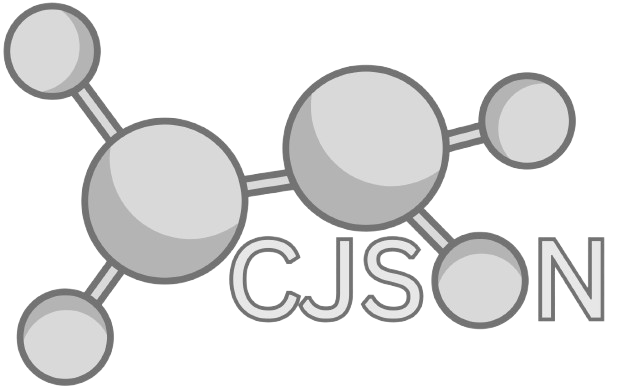

  

# Molecules CJSON
This is a collection of the molecules I've modeled in AvoGrado 2.
These CJSONS are using OpenChemistry's [chemicaljson schema.](https://github.com/OpenChemistry/chemicaljson)

## Current molecules built:
* Water (H2O)
* Methane (CH4)
* Ammonia (NH3)
* Thioketene (C2H2S)
* Ethylene Oxide (C2H4O)
